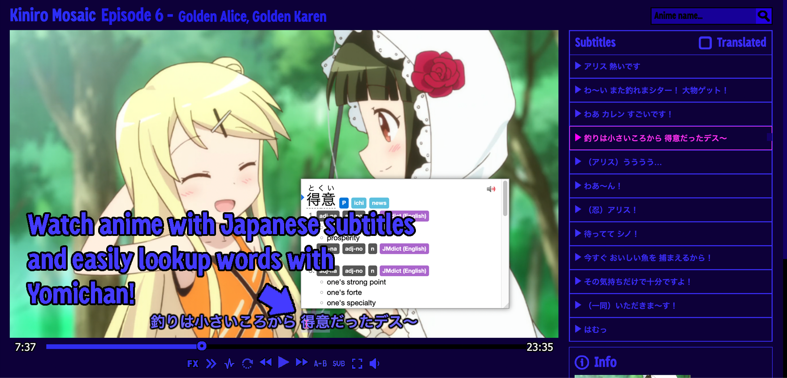
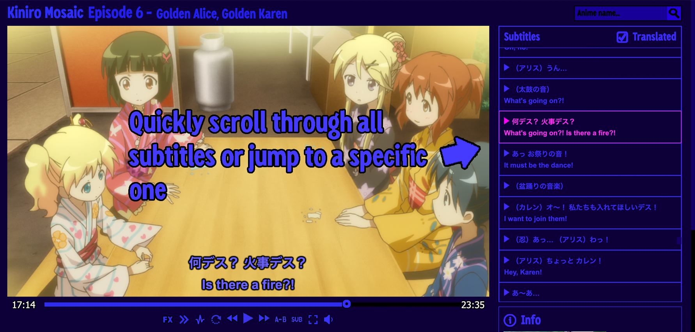
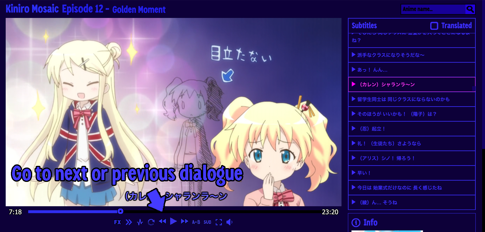
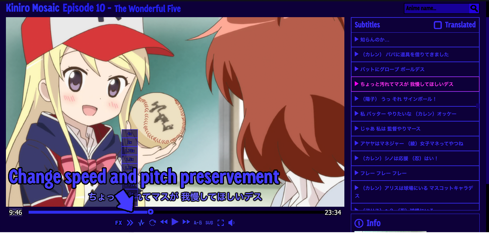
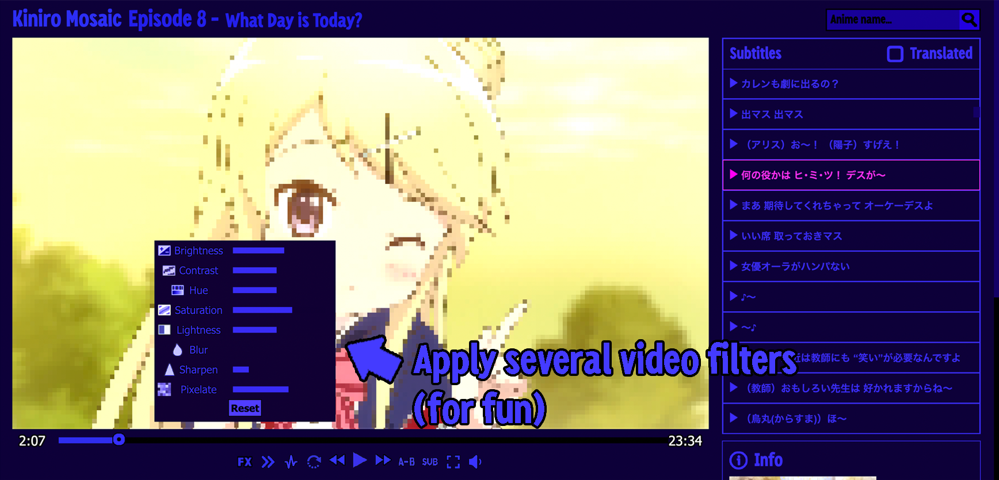

# Cuteanime.moe

Cuteanime is an anime viewer where you can watch anime with Japanese subtitles and lookup words with a dictionary extension like Yomichan. We get most of 
the Japanese subtitles from [Kitsunekko](https://kitsunekko.net).

We use a custom video player which is explained in more detail below.

### Switching Subtitles

You can quickly toggle between Japanese/English subtitles with the "Sub" button in the video player.

### Subtitle Catalog

The subtitle catalog shows the entire script of the episode allowing you to quickly navigate to a specific dialog, or 
search through all of the dialogues.

### Next/Previous Dialogues

You can quickly go to the next/previous dialogues with the arrow buttons. It also works with left/right arrow keys. 
These are all of the keyboard shortcuts:

- Space: Play/Pause
- Left Arrow: Previous Dialogue
- Right Arrow: Next Dialogue
- Up Arrow: Increase Volume
- Down Arrow: Decrease Volume

### Video Speed

You can change the video speed and pitch preservement to slow down the video if the characters are speaking 
too fast.

### A-B Looping

You can set a loop from point A to point B to continuosly loop over a specific section.

### Video Filters

Apply video filters such as brightness, contrast, hue, saturation, sharpen, and pixelate. \
*Note that this feature is only for fun.

### Official Website

Support the studio/publisher by buying the anime/manga from their website (a link is provided). 

### Tech Stack

- Languages: Typescript, LESS, HTML
- Front-end: React 
- Bundler: Webpack

### Self Hosting

First install Node.js if you don't have it already. 

https://nodejs.org/en/

To reduce costs, the whole "database" is stored in `database.js` and `episodes.js` files instead of using a 
real database.

You can look at `database.example.js` and `episodes.example.js` to see the structure of the database.

Clone the code from this repository and then install dependencies with `npm install`. \
Start the web server with `npm start`. 

All the web server does is load the `index.html` file, there is no real backend so this can be hosted as a static 
website. 

To load files from your local hard drive edit the pathname for the route `/Anime/*` in `server.tsx`.

If you need more detailed instructions, check https://github.com/Moebits/Cuteanime.moe/issues/1#issuecomment-1570601613.

### Manga Site
- [Cutemanga.moe](https://github.com/Moebits/Cutemanga.moe)
